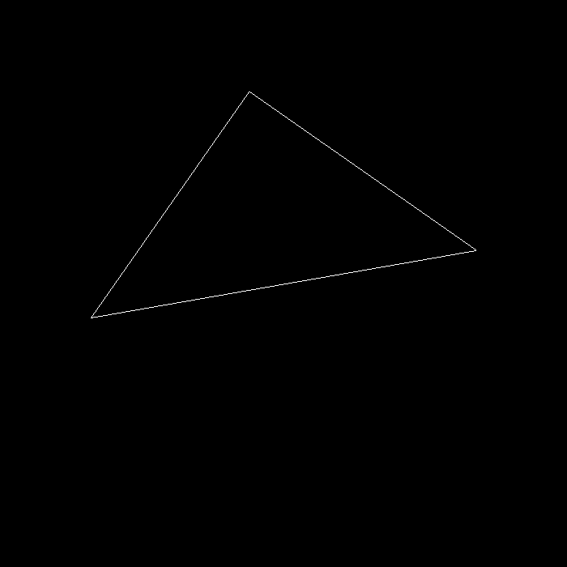

# Assignment 1: Rasterizer

This repo is the implementation of Assignment 1: Rasterizer of the open course: GAMES 101 -  Introduction to Computer Graphics. The repository relies on the following dependencies:

- OpenCV
- Eigen3

If your working environment is Linux but does not have OpenCV, use the following command to get the required libs: 

```
sudo apt install -y libopencv-dev
```

## Build Instruction

Easy scripts are provided:

```
./Clean
./Make
```

## Assignment Description

In this assignment, we practiced implementing the BASIC MVP transformation:

1. M is the model transformation that acts on the object in the virtual space. In this assignment, M is pure rotation in the XY plane.

2. V is the view transformation that gets the relative location of the object of the eye's frame.

3. P is the projection transformation that projects the object in the eye's view to a virtual canvas in front of the eye. In this assignment, we assumed a perspective camera, and hence, the projection is also divided into two steps: a. projection assuming an ortho-camera, b. squeezing the ortho-camera into the perspective camera.

Finally, any point on the object will be projected to the camera' canvas following: P * V * M * point. We can also press 'a' or 'd' to increase/decrease the rotation angle in the model transformation, hence making the object rotating counter-clockwise or clockwise. By passing more than one parameter to the program we can store the output images correspondingly. I.E. the following command saves the object which rotates 10 degrees counter-clockwise into the default filename 'output.png'.

```
./Rasterizer -r 10
```



## Related Links
- For more details of the open course GAMES 101, please refer to the [link](https://sites.cs.ucsb.edu/~lingqi/teaching/games101.html).
- For the collection of my implementations of all assignments of GAMES 101, please refer to this [repository](https://github.com/Eydcao/YanCG).